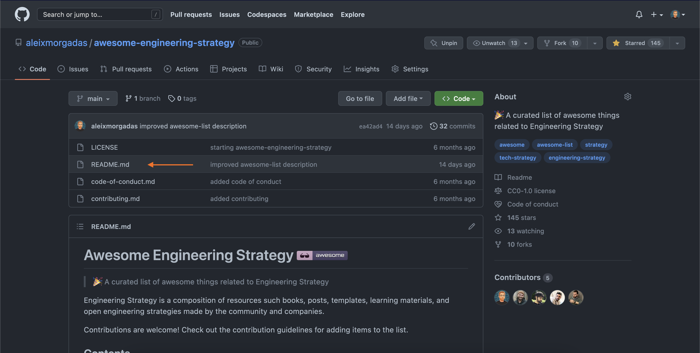
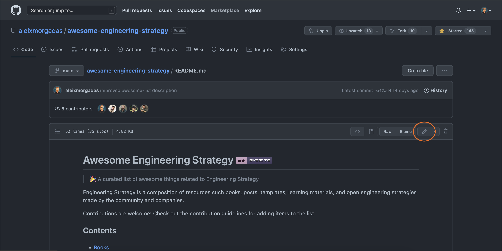
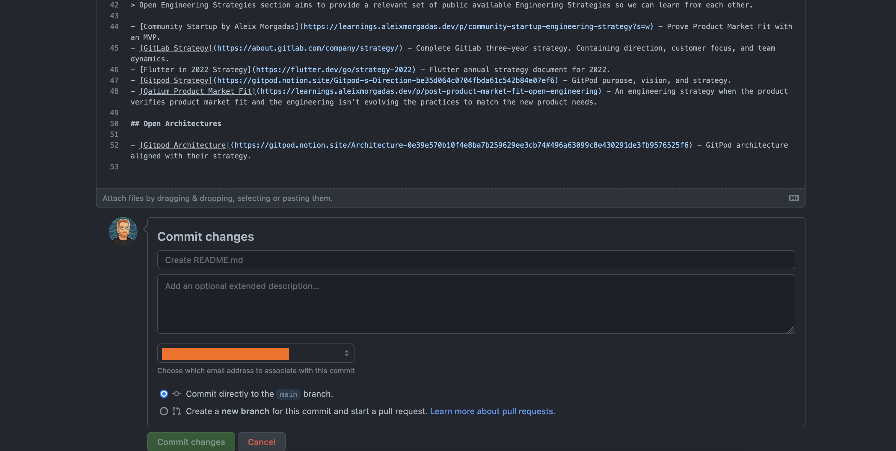

# Contribution Guidelines

Please note that this project is released with a [Contributor Code of Conduct](code-of-conduct.md). By participating in this project you agree to abide by its terms.

## Adding something to an awesome list

If you have something awesome to contribute to an awesome list, this is how you do it.

1. Go to the [awesome-engineering-strategy's GitHub page](https://github.com/aleixmorgadas/awesome-engineering-strategy).
2. Click on the `readme.md` file: 
3. Now click on the edit icon. 
4. You can start editing the text of the file in the in-browser editor. Make sure you follow guidelines above. You can use [GitHub Flavored Markdown](https://help.github.com/articles/github-flavored-markdown/).
5. Say why you're proposing the changes, and then click on "Propose file change". 
6. Submit the [pull request](https://help.github.com/articles/using-pull-requests/)!

## Updating your Pull Request

Sometimes, a maintainer of an awesome list will ask you to edit your Pull Request before it is included. This is normally due to spelling errors or because your PR didn't match the awesome-* list guidelines.

[Here](https://github.com/RichardLitt/knowledge/blob/master/github/amending-a-commit-guide.md) is a write up on how to change a Pull Request, and the different ways you can do that.
